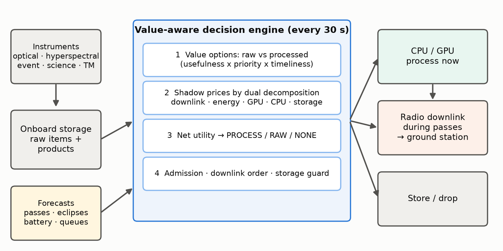
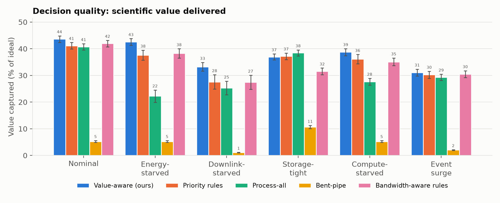
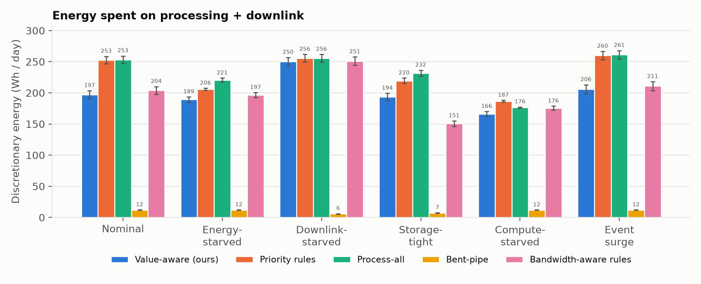
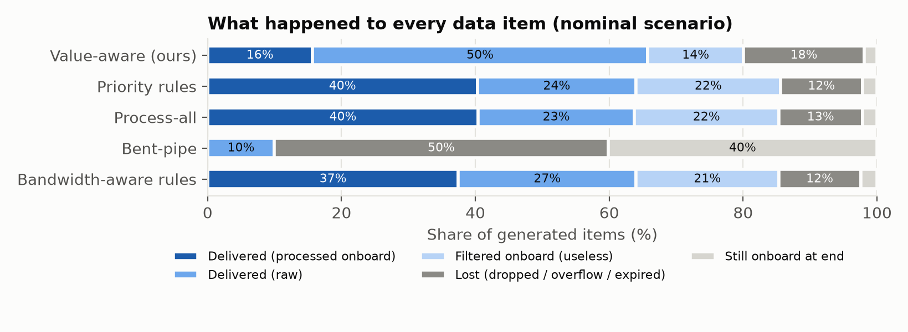

# Pricing Scarcity in Orbit: A Value-Aware Engine for Deciding Whether to Process, Store or Transmit Satellite Data

> Team name · IASTAM 2026 · Problem 1 "Process or Transmit?" · Interim paper, 26 September 2026

## Abstract

Earth-observation satellites acquire far more data than their ground contacts can return, and onboard processing can shrink data, filter useless acquisitions and cut latency, but it costs energy, compute time and storage while it waits. We treat the per-item choice between *processing now*, *storing for later*, *transmitting raw* and *dropping* as an online, multi-resource allocation problem with uncertain content usefulness and time-decaying value. We propose a value-aware decision engine that, every 30 s, prices five scarce resources (downlink volume, energy, GPU time, CPU time and storage) by dual decomposition over a forecast horizon of upcoming ground passes, and lets every item take the option with the best net value. Guards keep the battery reserve through the next eclipse and keep room in storage for incoming data, and each decision carries a one-line explanation. We release an open simulator and benchmark built on real orbit geometry: the Sentinel-2A orbit propagated from its current TLE with SGP4, passes over a Toulouse ground station and eclipses from the JPL ephemeris. The simulator's power system sheds loads so that the platform always survives the next eclipse. Six scenarios stress energy, downlink, storage, compute and urgent workload in turn, with stress levels set by one fixed rule: each offers 2/3 of what processing everything needs. We compare against four baselines, including a bandwidth-aware rule set, over 600 simulated days (6 scenarios × 5 strategies × 20 real days).

The engine delivered the most value in five of the six scenarios, capturing 2–20 % more than the best baseline. In paired comparisons it beat that baseline on 18–20 of the 20 days in each of those five scenarios. When mass memory is the bottleneck, processing everything immediately remains best (−1.5 points for the engine). The engine used 2–22 % less discretionary energy than the rule set and process-all.

An ablation study shows that re-valuing raw transmissions at their downlink-queue position contributes most, and that the shadow prices matter most when storage binds. We discuss the limits of this partly synthetic evaluation and the planned next steps.

## 1 Introduction

A small Earth-observation satellite in low Earth orbit can easily generate on the order of a hundred gigabytes per day, while a single ground station offers a few passes of a few minutes each. Downlink volume is therefore the classic bottleneck. The usual answer, recording everything and dumping as much as possible at each pass ("bent-pipe"), wastes the scarce downlink on data that is later found useless: cloudy scenes, false alarms, redundant measurements. It also delays time-critical information by hours.

Onboard processing changes this trade-off. A cloud-screening network or an event detector running on an onboard accelerator can discard useless data, compress useful data into small products and deliver urgent alerts at the next pass. Flight demonstrations such as Φ-Sat-1 [1] have shown that deep-learning inference onboard is feasible. However, processing is not free. It draws power that the solar array can only supply in sunlight, it occupies a scarce GPU or CPU, and data waiting to be processed or transmitted occupies finite mass memory. A satellite must therefore decide, continuously and autonomously, **what to process, when, and what to send**. It does so under energy, compute, memory, storage, bandwidth and contact-window constraints, and without knowing in advance which data is useful.

This interim paper addresses Problem 1 of the IASTAM challenge: *how can the system decide automatically, for each piece of data or task, whether it is preferable to process it immediately onboard, store it for later processing, or transmit it to the ground?* Our contributions are:

- **Formulation.** A formulation of the decision as an online, receding-horizon, multi-choice resource allocation over five coupled resources, with uncertain usefulness and value that decays with latency (Section 3).
- **Decision engine.** A value-aware decision engine that prices resources by dual decomposition, re-values raw transmissions at their queue position, and protects the spacecraft with explicit battery and storage guards. It needs no training and explains every decision (Section 4).
- **Open benchmark.** An open, reproducible simulator and benchmark dataset built on real orbit geometry. It includes four baselines, six scenarios calibrated by a single rule, a check that each scenario binds its resource, and metrics mapped to the five evaluation criteria of the challenge (Section 5).
- **Evaluation.** An evaluation over 600 simulated days, including paired comparisons, an ablation study and a sensitivity analysis (Section 6).

## 2 Related work

**Onboard processing and autonomy.** Autonomous science agents have flown for two decades. The EO-1 Autonomous Science Agent detected events onboard and re-planned acquisitions and downlinks [2]. Φ-Sat-1 demonstrated onboard deep-learning cloud detection that discards cloudy images before downlink [1]. Orbital edge computing studies how constellations of nanosatellites should process data in orbit when energy and contact time are limited [3]. These works establish that onboard processing is valuable. Our focus is the *resource-allocation policy* deciding, item by item, when processing pays off.

**Satellite scheduling.** Observation and downlink scheduling for agile satellites is usually solved offline on the ground, with heuristics, local search or exact methods over selection-and-sequencing formulations [4]. Such plans are typically computed on the ground and uplinked. We instead target an onboard, online policy that re-plans every step from local state and predictable forecasts.

**Shadow prices and decomposition.** Pricing constrained resources with Lagrange multipliers dates back to Everett's generalized Lagrange multiplier method for resource allocation [5]. Its decomposition interpretation underlies network utility maximization and congestion pricing [6, 7]. The per-step problem we face generalizes the multiple-choice knapsack problem [8]. Re-solving it at every step from the current state and forecasts follows the receding-horizon principle of model predictive control [9]. To our knowledge, combining these tools into an explainable onboard process-store-transmit engine, together with an open benchmark for it, has not been reported.

## 3 Problem formulation

### 3.1 System model

Time is discretized into decision steps of Δt = 30 s over a 24 h horizon.

**Orbit geometry (real).** The spacecraft flies the orbit of Sentinel-2A: 786 km, sun-synchronous, 100.6-min period. We propagate its two-line element set (TLE) of 26 September 2026, obtained from CelesTrak [13], with SGP4 [11] using the skyfield library [10], over 62 days at a 10 s resolution.

- **Passes** are computed for a ground station at CNES Toulouse (43.56° N, 1.48° E) above a 10° elevation mask. That gives 4.4 passes per day of 8.1 min on average, from under 2 min for grazing passes to over 10 min for overhead ones. At 10 MB/s this is about 21.5 GB/day of downlink.
- **Eclipses** come from the Sun–Earth geometry of the JPL DE421 ephemeris [12] and last 34.1 min per orbit.
- **Seeds.** Each seed simulates a different real day: evaluation seeds 0–19 are 26 September to 15 October 2026. Passes and eclipses are therefore irregular and realistic, not a fixed pattern.

**Resources and data (illustrative).** The satellite carries a battery charged by a solar array only in sunlight and drained by a constant platform load. Processing runs on 4 CPU cores and one GPU slot sharing 8 GB of RAM. A 32 GB mass memory holds raw data and products, and a radio transmits during passes. These are illustrative orders of magnitude for a small EO satellite and are varied across scenarios (Table 1).

{{scenarios_table}}

**Table 1.** Benchmark scenarios. Passes per day are real averages over 62 days for the given elevation mask. All other parameters are nominal: 22 W platform load, CPU 4 × 5 W, GPU 1 × 35 W, radio 20 W, 30 % battery reserve, 10 % hard floor.

The stress levels follow one rule, fixed before the evaluation and applied on the tuning days only (`tools/calibrate_scenarios.py`): in each stress scenario, the named resource offers **2/3 of what the process-all reference strategy needs** in the nominal scenario.

- **Energy-starved:** the daily solar surplus is 2/3 of process-all's discretionary energy. That gives a 44.8 W array, with a 60 Wh battery.
- **Storage-tight:** the mass memory is 2/3 of process-all's peak storage, which is 2.85 GB.
- **Compute-starved:** the GPU time is 2/3 of process-all's demand. This is a 4.72× slower, lower-power accelerator with the same energy per job.
- **Downlink-starved:** passes above 20° only, at half the data rate.
- **Event surge:** five times more urgent event candidates.

Instruments generate items of five types (Table 2). Arrivals follow a Poisson process, and optical instruments acquire only on the day side. Each item *i* has an acquisition time *ti*, a size *si*, a base value *bi* (its priority in the mission plan) and an onboard estimate *pi* of the probability that its content is useful. The true usefulness *ui* ∈ {0, 1} is hidden: a scene may turn out cloudy, an event candidate a false alarm. Onboard processing reveals *ui*. Useless items are discarded onboard; useful items become a product of size ρk *si* that keeps a fraction ηk of the value. Raw data keeps full value but must be processed on the ground, which adds a delay *gk*.

{{types_table}}

**Table 2.** Nominal data types. Per-item size varies by ±20 % and base value by ±50 %. *pi* ~ Beta around the type mean, and *ui* ~ Bernoulli(*pi*).

### 3.2 Value model

Value is realized only when data reaches the ground and becomes usable. With *L* the latency, *hk* the half-life and *Dk* the deadline of the item's type, the timeliness factor is

$$ δk(L) = 2−L / hk · 1[L ≤ Dk] $$

A raw item delivered at time τ is worth *bi* δk(τ − *ti* + *gk*) if it is useful. If it is not useful, it is worth a residual fraction *jk* of that, which is small for a cloudy image and zero for a false alarm. A processed product delivered at τ is worth *bi* ηk δk(τ − *ti*). Before processing, the engine only knows the expectations:

$$ E[Vraw] = bi (pi + (1 − pi) jk) δk(τraw − ti + gk),   E[Vproc] = pi bi ηk δk(τproc − ti) $$

The **ideal value** of an item, *bi* if useful and *bi jk* otherwise, assumes instant delivery with unlimited resources. It normalizes the score. It is not attainable, because many urgent events occur hours before the next pass.

### 3.3 Objective and constraints

The goal is to maximize the total delivered value over the mission. At every step the engine assigns each onboard item one of four routes: **PROCESS_NOW**, **STORE** (keep for later processing or transmission), **TRANSMIT** (downlink raw data or a finished product) or **DROP**. The simulator enforces all physical constraints regardless of what a policy asks for:

- **Energy.** The battery state of charge evolves with solar input (sunlight only), platform load, processing and radio power, clamped to its capacity. Like a spacecraft power-conditioning unit, the simulator sheds processing and radio loads before the charge would fall below the 10 % floor plus the energy the platform needs to cross the next eclipse. The platform load is therefore always met: no run of any strategy recorded a power failure.
- **Compute.** CPU and GPU slots and RAM limit the jobs that can run concurrently.
- **Storage.** Arrivals that do not fit in storage are lost (overflow).
- **Downlink.** Transmission happens only during passes, within their bandwidth and in the policy's priority order.
- **Deadlines.** Items past their deadline expire.

Even with perfect foresight the per-step problem generalizes the multiple-choice knapsack problem [8], and arrivals and usefulness are unknown in advance. We therefore seek a fast online policy.

## 4 The value-aware decision engine

Figure 1 summarizes the engine. At every step it performs the following operations on the current onboard state and the forecasts. The forecasts are pass and eclipse times, which are predictable from orbit propagation, plus battery and queue state.

### 4.1 Option valuation

For each raw item, the engine estimates the delivery time of each option. Raw data goes out at the next downlink opportunity. A product is delivered at the first pass after its processing would finish. The engine converts these times into E[Vraw] and E[Vproc] using the value model. Each option consumes a vector of resources *ai,r(o)*:

- **Raw option.** Downlink MB and radio energy. Keeping an item adds nothing to the storage it already occupies.
- **Processing option.** The expected product size *pi* ρk *si* on the downlink, processing energy, and GPU or CPU seconds. In storage it has a *negative* use: it frees the raw size minus the product size.

Products already in storage have only a transmit option. Items whose expected value has fallen below 0.1 % of their base value are marked worthless and dropped, because they cannot reach the ground before their deadline.

### 4.2 Shadow prices by dual decomposition

Given a price λr ≥ 0 per unit of resource *r*, each item independently takes the option with the best net utility:

$$ Ui(o) = E[Vi(o)] − Σr λr ai,r(o),   oi* = argmaxo ∈ {PROCESS, RAW, NONE} Ui(o),   Ui(NONE) = 0 $$

This is the Lagrangian relaxation of the coupled allocation [5, 6]. For each resource, the engine forecasts a supply *Sr* over a planning horizon ending with the *K*-th upcoming pass (*K* = 2):

- **Downlink:** the capacity of those passes.
- **Energy:** current charge above the reserve, plus solar harvest, minus platform load and minus energy already committed to running jobs.
- **GPU and CPU:** slot-seconds in the horizon, minus the work still left on running jobs.
- **Storage:** the free space left after a guard reserve and after the compact footprint of data expected to arrive before the next pass. It is negative when items already onboard must shrink to make room.

It then raises each price, in two rounds over the five resources, until planned use fits supply. The search doubles the price until the plan fits, then refines it by geometric bisection:

$$ Σi ai,r(oi*) ≤ Sr   for every resource r $$

A price stays at zero while its resource is plentiful. In particular, energy is free when the battery is full in sunlight, because unused solar power would be wasted. A price rises to the value density of the marginal item when its resource binds. This explains why the engine sends raw data when bandwidth is spare but switches to compact products when passes are saturated. When storage runs short, the storage price rewards processing precisely because processing frees space.

### 4.3 Queue-aware re-valuation

The first pass assumes that every raw item leaves at the start of the next pass, which is optimistic when the queue is long. The engine therefore sorts the items routed to RAW by value density. It computes each item's actual completion time from the cumulative volume ahead of it and the pass schedule, re-values the item at that time, and solves the prices a second time.

### 4.4 Admission, downlink order and guards

Items routed to PROCESS start immediately, in order of utility gain per processing second, if three conditions hold:

- a slot of the right type is free;
- enough RAM is free;
- the job fits the **battery headroom**: the energy that can be spent now while staying above the 30 % reserve through the next eclipse, including the radio energy of any pass before the next sunrise.

Otherwise the item is **stored** for later processing. During a pass, items routed to RAW (raw data or products) are sent in decreasing order of

$$ ki = [Vi(now) + wu (Vi(now) − Vi(next pass))] / si $$

This is value per MB plus an urgency term: the value lost by waiting for the next pass.

A **storage guard** keeps free space for five minutes of peak acquisition, and at least 5 % of capacity. When space runs short it drops items, cheapest per MB first. It only drops an item worth less per MB than the data it makes room for, which is the expected value density of new acquisitions (≈ 0.03 value/MB for the nominal instruments). Small, valuable items such as telemetry are therefore never sacrificed to free space for bulk imagery.

### 4.5 Explainability and cost

Every decision carries a one-line explanation generated from the quantities above, together with the current prices. Verbatim examples from the seed-7 replays:

- *"process now: U_proc 10.66 > U_raw 7.54; ~1 MB product vs 33 MB raw"* (an event candidate, nominal, T+9.0 h).
- *"transmit raw: U_raw 4.47 >= U_proc 2.74"* (a hyperspectral cube in the nominal case: with spare downlink, raw data keeps more science).
- *"process now: U_proc very high (frees scarce storage) > U_raw 4.47; ~26 MB product vs 651 MB raw [… storage saturated]"* (the same kind of cube when storage is tight).
- *"drop: no pass before its value decays away"* (an event candidate acquired hours before the next pass).

When no price can make the plan fit (for example, storage that even full processing cannot free), the price saturates and the explanation says so in words.

The per-step computation is dominated by the price search: at most a few hundred vectorized evaluations over the *n* onboard items. Measured on one laptop core in pure Python/NumPy over 17,280 decisions (seed 7, all six scenarios), a decision takes 1.5 ms on average, 3.8 ms at the 95th percentile and at most 8 ms, with up to 277 items onboard. That is more than three orders of magnitude below the 30 s decision period.

## 5 Experimental setup

**Simulator.** The simulator is discrete-time and seeded. It keeps all state in immutable objects, and it alone holds the hidden usefulness truth. It enforces every hard constraint, so policies cannot cheat. For a given seed every strategy faces exactly the same real day of passes and eclipses and the same data. The geometry is precomputed once (`satsched.cli geometry`) and stored with its provenance (TLE, station, mask, ephemeris), so experiments do not need skyfield.

**Baselines.**

- **Bent-pipe:** never process; downlink everything raw, oldest first.
- **Process-all:** process every processable item as soon as a slot is free (FIFO); downlink products and telemetry, oldest first.
- **Priority rules:** a hand-tuned operations rule set.
  - Static priority classes: events, then telemetry, then hyperspectral, then optical, then science.
  - Battery thresholds for processing: events always; optical and hyperspectral above 50 %; science above 70 %.
  - Leftover pass capacity filled with raw data by priority.
  - Drop low-priority items above 90 % storage.
- **Bandwidth-aware rules:** the priority rules plus what a careful operator would add to exploit spare downlink. Hyperspectral cubes and optical images forecast useful (*pi* ≥ 0.7) are kept raw, highest priority first, while they fit in 80 % of the next two passes and in half of the mass memory. The thresholds were fixed a priori.

**Metrics.** Each of the five evaluation criteria of the challenge maps to measured quantities:

- **Decision quality:** value captured, as a percentage of the ideal value.
- **Completed tasks:** the share of items delivered or correctly filtered onboard, with delivered, lost and backlog shares reported separately.
- **Energy:** discretionary energy (processing + radio), Wh per unit of value, lowest battery charge, time below the reserve, and unmet platform load (power failures).
- **Latency:** mean and 95th percentile, and the latency of true urgent alerts.
- **Resource use:** GPU/CPU busy time, share of pass capacity used, and mean and peak storage.

**Protocol.** Engine parameters and scenario stress levels were set only on seeds 1000–1003, which are real days 24–27 and never overlap the evaluation days. All reported results use seeds 0–19: 20 real days per scenario and strategy, 600 simulated days in total. We report means with 95 % confidence intervals. Because every strategy sees the same days, we also report paired differences. As a robustness check, we repeated the whole benchmark with a synthetic geometry (Section 6.6).

**Scenario validation.** A stress scenario is only informative if its resource actually binds. Table 3 shows, for each stress scenario, the named resource under load, nominal → stressed, for every strategy that processes data. The battery falls to the load-shedding floor for process-all and within a few points of the reserve for the others. Storage peaks at 90–99 %, passes run full, and the GPU is busy 86–96 % of the day.

{{binding_table}}

**Table 3.** Scenario validation: the binding resource of each stress scenario, nominal → stressed (mean over the 20 evaluation days).

## 6 Results

### 6.1 Decision quality

Table 4 and Figure 2 give the main results. The value-aware engine captures the most value in five of the six scenarios. Its margin over the best baseline in each scenario:

- **Downlink-starved:** 33.2 % vs 27.6 % for the rules (+20 % relative). When passes are scarce, choosing which items to send raw and which to shrink matters most.
- **Energy-starved:** 42.5 % vs 38.3 % for the bandwidth-aware rules (+11 %). Process-all is throttled by load shedding and falls to 22.2 %.
- **Compute-starved:** 38.7 % vs 36.1 % for the rules (+7 %). Process-all queues everything on the slow accelerator and reaches only 27.7 %.
- **Nominal:** 43.6 % vs 41.9 % for the bandwidth-aware rules (+4 %).
- **Event surge:** 31.1 % vs 30.5 % (+2 %).
- **Storage-tight:** when mass memory is the bottleneck, processing everything immediately is hard to beat. Process-all captures 38.4 % against 36.9 % for the engine, which ties the rule set and beats the bandwidth-aware rules by 5.4 points. With 2.85 GB, any raw data held for a pass hours away competes with incoming acquisitions. The engine forecasts arrivals as averages, so acquisition bursts still cost it overflow and drops that shrinking everything at once avoids.

Bent-pipe captures only 1–11 %: without onboard filtering, the downlink is spent on cloudy scenes and false alarms, storage overflows and urgent data expires. The bandwidth-aware rules gain less than a point over the plain rules (nominal, energy-starved, event surge) and lose elsewhere. Simply filling spare downlink with raw imagery therefore does not reproduce the engine's gains: what matters is valuing each item.

{{results_table}}

**Table 4.** Benchmark results: mean ± 95 % CI over 20 days. "Energy" is discretionary energy (processing + radio) per day. "Alert lat." is the mean latency of true event alerts.

Because all strategies face identical passes and data for a given seed, paired differences are much tighter than the across-seed intervals of Table 4 (Table 5). In five scenarios the engine beats every processing baseline on 18–20 of the 20 days, and all these paired 95 % intervals exclude zero. In the storage-tight scenario the engine:

- ties the rule set (−0.21 ± 0.59 points);
- trails process-all by 1.51 ± 0.43 points, winning 2 of 20 days;
- beats the bandwidth-aware rules on every day.

{{paired_table}}

**Table 5.** Paired comparison against the three processing baselines over the 20 shared days: mean difference in value captured (percentage points, ± 95 % CI) and the number of days on which the value-aware engine is better.

### 6.2 Energy and battery safety

The engine spends 2–22 % less discretionary energy than the rule set and process-all (Figure 3). The saving is largest in the nominal case (−22 %) and smallest under downlink starvation (−2 %), where every strategy must process almost everything. The bandwidth-aware rules, which also send raw data, use about as little energy as the engine. The exception is the storage-tight case, where they process little and pay for it in value. The engine processes only where processing adds value: it filters and compresses when bandwidth, storage or compute are scarce, and sends raw data when passes have spare capacity. Its battery guard also defers any job that would push the charge below the reserve before the next sunrise.

In the energy-starved scenario the strategies behave very differently (Figure 4):

- **Process-all** hits the load-shedding floor (10 %): 2,034 job-steps per day stall for lack of power, and it spends 55 % of the day below the reserve.
- **The rule set** oscillates around its 50 % processing threshold, with a lowest charge of 23 %.
- **The engine** keeps a mean lowest charge of 28 % and is below the reserve 3.3 % of the time, while delivering the most value: 42.5 % vs 38.3 %.
- **No strategy** ever caused a power failure.

### 6.3 Completion, latency and resource use

The engine delivers the largest share of items in four scenarios: 65.0 % vs 63.7 % on average in the nominal case (Figure 5 shows one day). No item expires onboard. Its **completion rate** (delivered + filtered onboard) is higher than the rule set's when energy or storage is short: 78.8 % vs 74.0 % and 74.3 % vs 71.7 %. It is the highest of all strategies when energy-starved. In the other four scenarios it is 2–9 points lower than the rule set's, for example 79.4 % vs 84.7 % in the nominal case. There are two reasons:

- It sends raw data when bandwidth allows. A raw item delivers more value, but it is never "filtered onboard", which is the second way an item counts as complete.
- It proactively drops items that can no longer reach the ground before their deadline, instead of letting them expire or processing them for no value.

We report this trade-off explicitly because completion is one of the challenge's criteria. A mission that rewards completion itself can raise its weight in the value model. Urgent-alert latency equals the rule set's: 140 min in the nominal case, and 158 vs 159 min under downlink starvation, against 234 min for process-all. Outside storage-tight, the engine uses 98–100 % of pass capacity. The rule set and process-all use 16–99 %, and much less whenever the downlink is not the bottleneck. The cost is more data held in storage: a peak of 39 % vs 13 % in the nominal case.

### 6.4 Ablation study

Table 6 removes one component at a time, evaluated on the same 20 days.

{{ablation_table}}

**Table 6.** Ablation: value captured (%, mean ± 95 % CI), and the time below the battery reserve in the energy-starved scenario.

Four findings stand out, all from paired runs on identical days.

1. **The storage price is indispensable when memory binds.** Without it, or without prices at all, the engine stops processing in the storage-tight scenario. Overflow triples (4.3 % vs 1.5 % of items) and value collapses from 36.9 % to 23.8 %. It has no effect in the other scenarios.
2. **Queue-aware re-valuation** adds 0.5–1.4 points wherever the downlink queue matters: nominal, energy-starved, downlink-starved and event surge. It adds nothing when storage or compute binds.
3. **The battery guard is a safety net.** Removing it in the energy-starved scenario lowers the mean lowest charge from 28 % to 17 %. It also multiplies the time below the reserve by four (13.1 % vs 3.3 %). The value gain is not significant (0.6 ± 0.7 points).
4. **The other prices add up to 0.7 points.** In the compute-starved scenario they cost 0.7 points instead, a sign that the GPU price, solved over a two-pass horizon, is slightly conservative there.

With prices set to zero, the engine reduces to an explicit expected-value comparison with guards. This already beats the heuristics whenever storage is not the bottleneck. The energy price rarely becomes positive, because the planning horizon spans several orbits of solar harvest; the battery guard handles short-term energy scarcity. A shorter energy horizon and a GPU price solved over the processing queue are natural refinements.

### 6.5 Sensitivity

On the tuning seeds, we varied the planning horizon (*K* ∈ {2, 3, 5} passes), the storage guard (300 or 900 s of peak acquisition) and the urgency weight (*wu* ∈ {0, 1}). Across all 12 combinations, the average value over the six scenarios stayed within 34.6–36.2 %. The defaults are within 0.01 points of the best combination (`tools/sensitivity.py`). The planning horizon and the urgency weight changed the average by at most 0.08 points. Only the storage guard mattered: a 15-minute guard wastes half of a 2.85 GB memory, which costs 1.5 points on average. In an earlier sweep on the synthetic geometry, varying the worthless-item threshold (1 %, 0.1 % or 0) changed value by at most 0.1 points. Beyond keeping the storage guard proportionate to the memory, the engine does not depend on fine-tuning. Its behaviour comes from explicit valuation and prices that adapt automatically to each scenario.

### 6.6 Robustness: synthetic geometry

We repeated the whole benchmark on a synthetic geometry, with the same seeds, engine, baselines and stress rule. The geometry is a 95-min orbit with fixed 35-min eclipses and two clusters of three passes per day, which gives 29 GB/day of downlink. Table 7 gives the value captured.

The pattern is the same as on the real orbit. The engine ranks first in five of six scenarios. When storage is tight it trails process-all and the rule set (36.6 % vs 39.1 % and 38.7 %). The real geometry has fewer and irregular passes (21.5 GB/day), which widens the engine's advantage when the downlink binds. The qualitative conclusions do not depend on the geometry.

{{synthetic_table}}

**Table 7.** Value captured (%, mean ± 95 % CI over 20 days) with the synthetic geometry.

## 7 Discussion and limitations

**What is real and what is not.** The orbit, passes and eclipses are real (Sentinel-2A over Toulouse). Satellite resources, workload and value parameters are plausible orders of magnitude, not a specific mission. The ranking of strategies was stable across six scenarios and two geometries, but absolute numbers should not be over-interpreted.

**When to process everything.** When mass memory is the tightest resource, the simple process-everything policy was the best we tested. A natural extension is to let the engine recognise that regime: it can raise its storage guard in proportion to the forecast acquisition bursts, or switch to immediate processing when the storage price saturates.

**Value model.** The value model (priority × usefulness × exponential timeliness decay) is an assumption. It is also the lever through which operators would express mission priorities. The engine is agnostic to its exact form: any function of delivery time can be used.

**Forecasts.** The engine's pass and eclipse forecasts come from the same propagated orbit, so they are exact. In operations, TLE-based predictions drift by seconds to minutes over days. SGP4 errors also grow across our 62-day span, which affects the timing of individual later days but not the statistics of the pass geometry. Link outages, elevation-dependent data rates and battery ageing are not modelled.

**Optimality.** The prices come from two coordinate-wise rounds, an approximate dual solution. Planned use can therefore slightly exceed a forecast supply, but the simulator still enforces every hard limit. We compare against heuristics, not yet against an optimum. A hindsight mixed-integer program on reduced instances would bound the optimality gap. It is the first item of our future work.

**Completion metric.** The engine optimizes value, not item counts. Section 6.3 explains the resulting completion trade-off.

**Onboard cost.** The engine costs about 1.5 ms per step on a laptop core. On a flight processor it would be slower, but the 30 s period leaves ample margin, and the computation is vectorized and allocation-light.

## 8 Conclusion and next steps

Valuing every option explicitly, pricing the resources that bind, and guarding battery and storage is a simple, explainable and effective way to decide onboard whether to process, store or transmit. On a benchmark built on Sentinel-2A's real orbit, it captured the most value in five of six scenarios, beating four baselines on 18–20 of 20 days in each. It uses markedly less energy and keeps a battery margin when energy is scarce. When mass memory is the binding constraint, processing everything immediately remains slightly better. Before the final submission we plan to:

- compute hindsight-optimal schedules with a mixed-integer program on reduced instances, to measure the optimality gap;
- replace the Beta-distributed usefulness estimate with the output of a small onboard classifier, such as a cloud-probability network;
- add forecast errors, several ground stations and inter-satellite relays;
- port the engine to an embedded target to measure its real runtime;
- calibrate the scenarios against a published small-satellite mission.

Code, dataset, dashboard and all results are available in the project repository.

## References

[1] G. Giuffrida et al., "The Φ-Sat-1 Mission: The First On-Board Deep Neural Network Demonstrator for Satellite Earth Observation," *IEEE Transactions on Geoscience and Remote Sensing*, vol. 60, 2022.

[2] S. Chien et al., "The EO-1 Autonomous Science Agent," in *Proc. 3rd Int. Joint Conf. on Autonomous Agents and Multiagent Systems (AAMAS)*, 2004.

[3] B. Denby and B. Lucia, "Orbital Edge Computing: Nanosatellite Constellations as a New Class of Computer System," in *Proc. ASPLOS*, 2020.

[4] M. Lemaître, G. Verfaillie, F. Jouhaud, J.-M. Lachiver and N. Bataille, "Selecting and scheduling observations of agile satellites," *Aerospace Science and Technology*, vol. 6, no. 5, 2002.

[5] H. Everett III, "Generalized Lagrange Multiplier Method for Solving Problems of Optimum Allocation of Resources," *Operations Research*, vol. 11, no. 3, 1963.

[6] D. P. Palomar and M. Chiang, "A Tutorial on Decomposition Methods for Network Utility Maximization," *IEEE Journal on Selected Areas in Communications*, vol. 24, no. 8, 2006.

[7] F. P. Kelly, A. K. Maulloo and D. K. H. Tan, "Rate control for communication networks: shadow prices, proportional fairness and stability," *Journal of the Operational Research Society*, vol. 49, 1998.

[8] H. Kellerer, U. Pferschy and D. Pisinger, *Knapsack Problems*, Springer, 2004.

[9] D. Q. Mayne, J. B. Rawlings, C. V. Rao and P. O. M. Scokaert, "Constrained model predictive control: Stability and optimality," *Automatica*, vol. 36, no. 6, 2000.

[10] B. Rhodes, "Skyfield: High precision research-grade positions for planets and Earth satellites generator," Astrophysics Source Code Library, ascl:1907.024, 2019.

[11] D. A. Vallado, P. Crawford, R. Hujsak and T. S. Kelso, "Revisiting Spacetrack Report #3," in *Proc. AIAA/AAS Astrodynamics Specialist Conference*, AIAA 2006-6753, 2006.

[12] W. M. Folkner, J. G. Williams and D. H. Boggs, "The Planetary and Lunar Ephemeris DE 421," *IPN Progress Report* 42-178, NASA Jet Propulsion Laboratory, 2009.

[13] CelesTrak, current GP element sets (TLE) for NORAD 40697 (SENTINEL-2A), https://celestrak.org, retrieved 26 September 2026.

## Appendix A: Reproducibility

The full pipeline runs with the commands below.

- **Orbit geometry** (needs skyfield + DE421): `python -m satsched.cli geometry` (Sentinel-2A TLE in `data/orbit/`)
- **Tests:** `python -m pytest --cov`
- **Scenario calibration:** `python tools/calibrate_scenarios.py`
- **Sensitivity:** `python tools/sensitivity.py`
- **Benchmark:** `python -m satsched.cli bench --seeds 20`
- **Ablation:** `python -m satsched.cli ablation --seeds 20`
- **Dataset:** `python -m satsched.cli dataset --seeds 3`
- **Figures:** `python -m satsched.cli figures`
- **Paper:** `python tools/build_paper.py`

All randomness is seeded. Each strategy sees identical passes and data for a given seed. Per-run metrics are in `results/runs.csv` and `results/ablation_runs.csv`.
